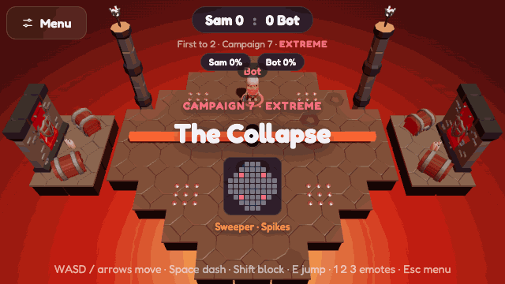
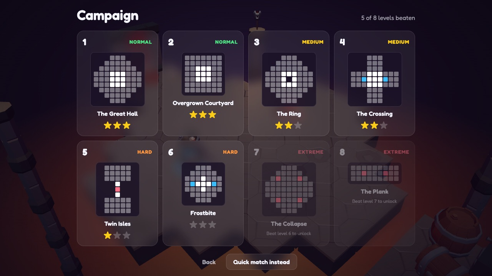
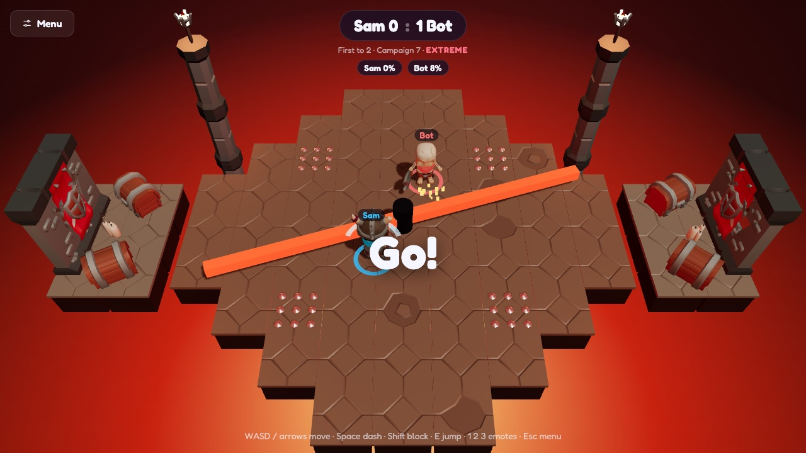
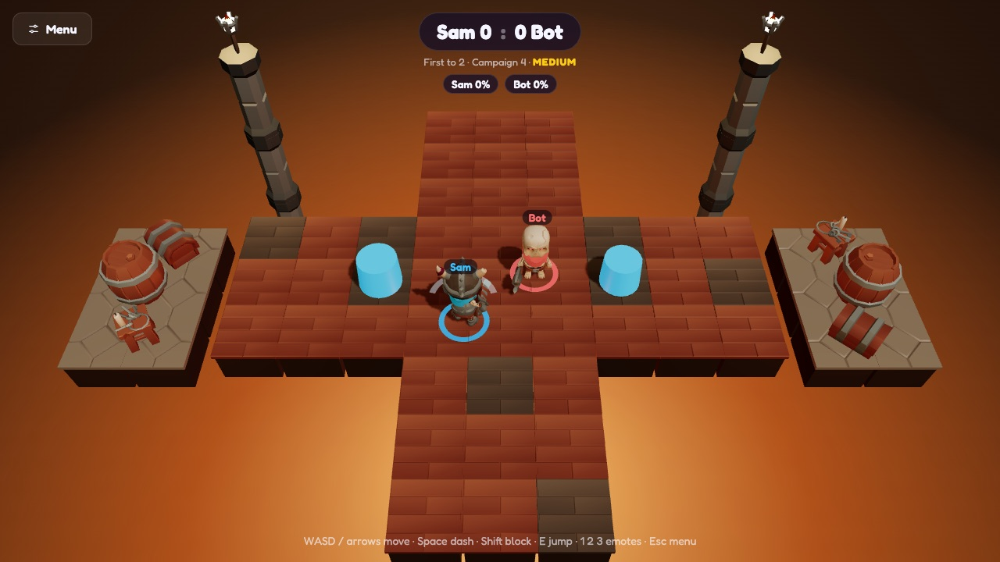
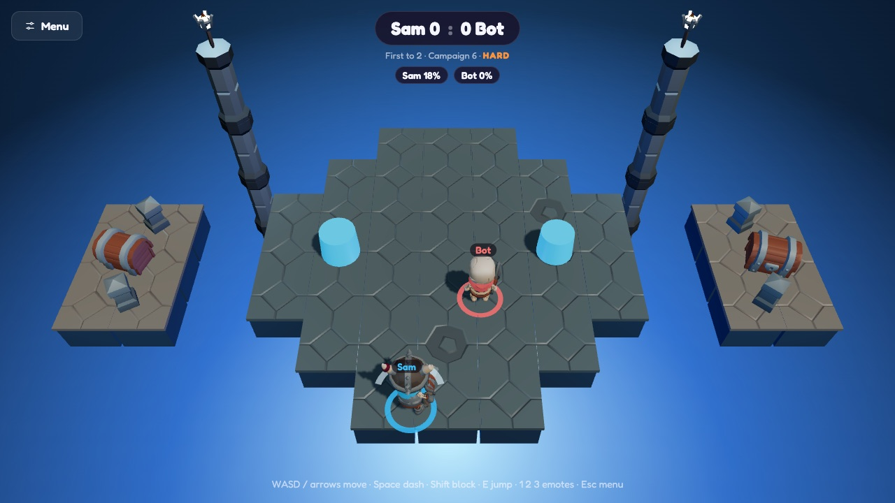
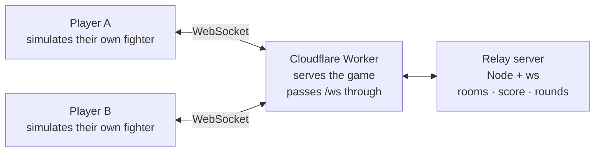

<div align="center">


### A 3D knockout arena that runs in your browser

Dash into your rival, send them flying, and be the last skeleton standing<br />
while the floor falls away beneath you.

<br />

[](https://plonko.samdanymdahsanahmed.workers.dev)
&nbsp;
[](https://ahsanahmed.itch.io/plonko)

<br />


<br />



<sub>A round on <b>The Collapse</b>, the first Extreme stage. Recorded from the real game.</sub>

</div>

<br />

## Play it

| | |
|---|---|
| **Solo** | An eight-level campaign against a bot that gets tougher every stage. Up to three stars per level, saved in your browser. |
| **With a friend** | Create a room and send the link. Whoever opens it joins your match. No accounts, no download. |
| **On a phone** | On-screen stick and buttons appear automatically on touch devices. |

**[Play now →](https://plonko.samdanymdahsanahmed.workers.dev)**

<br />

## What's in it

<table>
<tr>
<td width="50%" valign="top">



**Eight stages, four tiers.** Each stage is a floor map, a colour theme, a collapse schedule and a set of hazards. They double as the solo campaign's levels.

</td>
<td width="50%" valign="top">



**Hazards.** A sweeper bar you can jump, spike tiles that warn before they fire, and bumpers that bounce you away.

</td>
</tr>
<tr>
<td width="50%" valign="top">



**A floor that falls away.** Tiles shake, glow, then drop, in an order every player's game works out identically. A round cannot be stalled.

</td>
<td width="50%" valign="top">



**More than one button.** Dash to attack, block to throw the hit back at the attacker, jump to dodge. Damage builds up, so every hit you take makes the next one send you further.

</td>
</tr>
</table>

Also: three power-ups (heavy, quick dash, shockwave), four skeletons each with their own weapon and attack, emotes, a match summary, and music and sound effects generated in code, so the game ships no audio files.

<br />

## Controls

| Action | Keyboard | Touch |
|---|---|---|
| Move | <kbd>W</kbd> <kbd>A</kbd> <kbd>S</kbd> <kbd>D</kbd> or arrow keys | Left stick |
| Dash / attack | <kbd>Space</kbd> | **Dash** |
| Block | hold <kbd>Shift</kbd> | hold **Block** |
| Jump | <kbd>E</kbd> | **Jump** |
| Emotes | <kbd>1</kbd> <kbd>2</kbd> <kbd>3</kbd> | ☺ |
| Menu | <kbd>Esc</kbd> | **Menu** |

<br />

## How the multiplayer works



Plonko uses a **client-relay** model, not an authoritative server. It is the simpler of the two standard designs, and the trade-off is worth stating plainly.

- **Each player's browser simulates only its own fighter** and sends its position twenty times a second. The other fighter is drawn slightly in the past, interpolated between the updates received.
- **The attacker's game decides whether a dash connected**, and the victim's game applies the knockback. What you saw is what you hit.
- **The victim's game decides whether they blocked**, and sends the recoil back.
- **The server never runs physics.** It owns the things two players must agree on: who is in the room, the score, when a round ends, which stage comes next, and who picked up a contested power-up.

**What this costs.** A modified client could lie about its position or its hits, so this design is not cheat-resistant, and two players can briefly disagree about a close call. For a game played between friends over a shared link, that is an acceptable price for netcode that fits in a few hundred lines. An authoritative server is the natural next step if it ever needed to be competitive.

A few problems that turned out to be more interesting than expected:

<details>
<summary><b>Keeping two games in step without sending the world</b></summary>
<br />

The falling floor, the sweeper's angle, the spikes' timing and where power-ups appear are never transmitted. Each is a pure function of the round clock and a seed the server hands out, so both players compute the same thing independently. Only decisions that are genuinely contested go over the wire.

</details>

<details>
<summary><b>A player in a background tab froze, and could not be knocked off</b></summary>
<br />

Browsers stop animation frames and throttle timers in a hidden tab. Because each player simulates their own fighter, a tabbed-away player stood still on everyone's screen, immune to knockback. The game now steps itself from a Web Worker timer whenever its own frames stall, and skips drawing while it does.

</details>

<details>
<summary><b>Ad blockers refused the connection</b></summary>
<br />

The relay sits on a free dynamic-DNS address, and Brave's built-in blocker rejects third-party connections to those, so players using Brave could not get online. The game now connects to its own site's address, and the Cloudflare Worker passes the socket through to the relay.

</details>

<br />

## Built with

| | |
|---|---|
| **Rendering** | [React Three Fiber](https://r3f.docs.pmnd.rs) and [drei](https://drei.docs.pmnd.rs) on Three.js |
| **Physics** | [Rapier](https://rapier.rs), through `@react-three/rapier` |
| **State** | Zustand |
| **Networking** | Plain WebSockets: the browser API on the client, [`ws`](https://github.com/websockets/ws) on a Node relay |
| **Audio** | The Web Audio API, with every sound and the music synthesised at runtime |
| **Hosting** | Cloudflare Workers for the game, an Oracle Cloud free-tier VM for the relay, itch.io for the storefront |

Everything runs on free tiers.

<br />

## Run it locally

You need Node 20 or newer.

```bash
git clone https://github.com/sam666-deb/Plonko.git
cd Plonko
npm install
npm run dev
```

This starts the relay on port 8787 and the game on the address Vite prints. Open that address in two separate browser windows to play against yourself, or use the **Network** address from a second device on the same Wi-Fi.

Press <kbd>`</kbd> in development to open a panel for tuning movement, knockback and the bot live.

```
Plonko/
├─ client/     the game: React Three Fiber scene, physics, UI
├─ server/     the WebSocket relay
├─ shared/     the message protocol and stage data, used by both
└─ worker.js   the Cloudflare Worker that serves the game and proxies the relay
```

<br />

## Where the idea comes from

Knocking opponents off a platform is a well-worn genre. [Bonk.io](https://bonk.io) has done it in 2D in the browser since 2016, and Stumble Guys and Knockout City do it in 3D as native games. Plonko does not claim a new idea.

What it does differently is the combination: full 3D with real physics, running in a browser tab, where sharing a link is the entire process of starting a match.

<br />

## Credits

- **Characters, weapons and dungeon art** are from the [KayKit](https://kaylousberg.itch.io/) packs by [Kay Lousberg](https://www.kaylousberg.com), used under CC0.

<div align="center">
<br />

**[▶ Play Plonko](https://plonko.samdanymdahsanahmed.workers.dev)**

</div>
